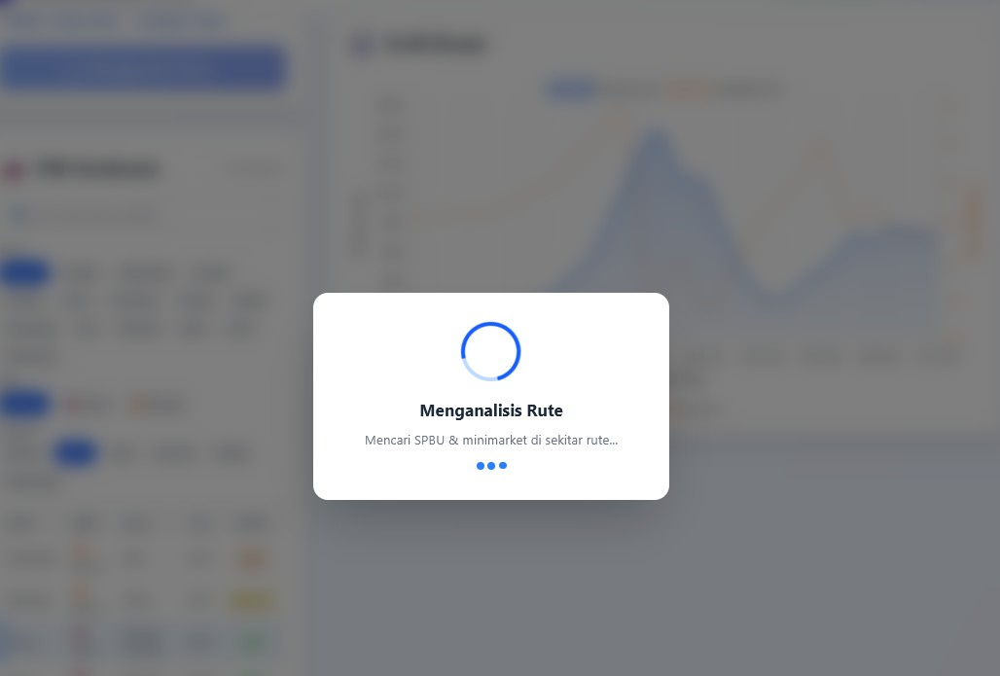
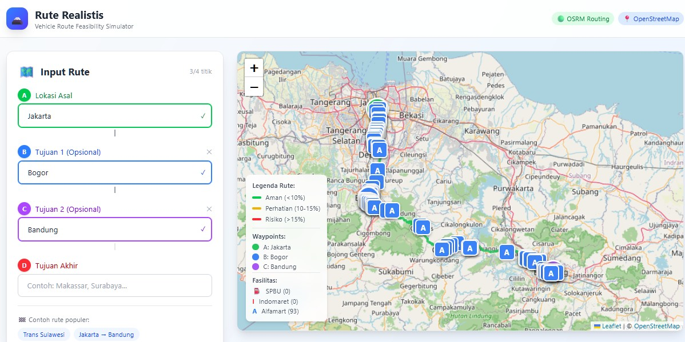
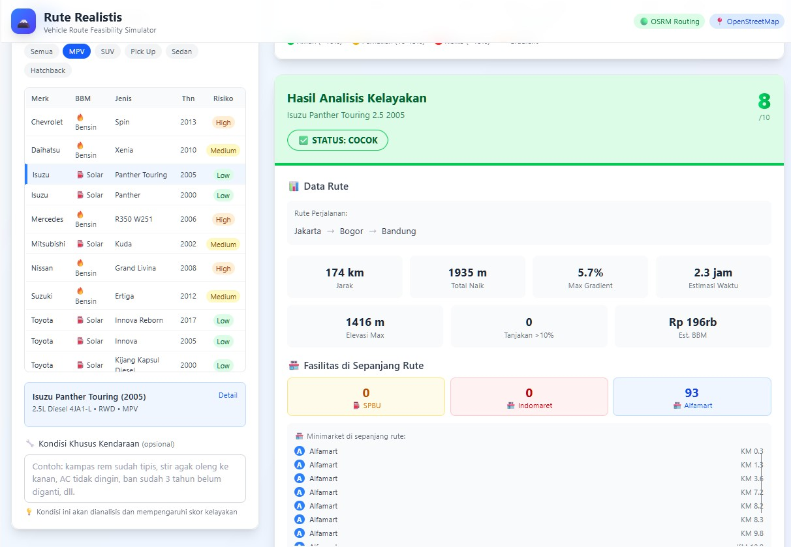
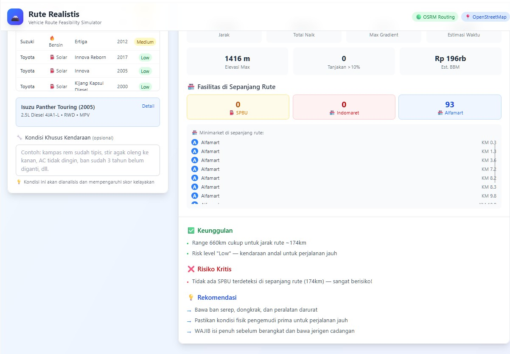

# 🗻 Vira - Vehicle Route Analysis Simulator

Aplikasi web untuk mensimulasikan kelayakan kendaraan pada rute tertentu di Indonesia. Bantu tentukan apakah mobil Anda cocok untuk rute yang akan dilalui berdasarkan spesifikasi kendaraan dan kondisi medan.


## 📋 Daftar Isi

- [Fitur Utama](#-fitur-utama)
- [Demo](#-demo)
- [Tech Stack](#-tech-stack)
- [API yang Digunakan](#-api-yang-digunakan)
- [Instalasi](#-instalasi)
- [Cara Penggunaan](#-cara-penggunaan)
- [Struktur Project](#-struktur-project)
- [Database Kendaraan](#-database-kendaraan)
- [Sistem Analisis](#-sistem-analisis)
- [Kontribusi](#-kontribusi)
- [Lisensi](#-lisensi)
- [Kredit](#-kredit)

## 🎯 Fitur Utama

### 1. 🗺️ Input Rute Multi-Waypoint
- Input hingga **4 titik lokasi** (1 asal + 3 tujuan perantara)
- Autocomplete lokasi menggunakan **Nominatim API** (OpenStreetMap)
- Quick start buttons untuk rute populer di Indonesia:
  - Trans Sulawesi (Manado → Gorontalo → Palu → Makassar)
  - Jakarta → Bandung
  - Medan → Danau Toba
  - Surabaya → Batu

### 2. 🚗 Database Kendaraan Lengkap
- **66 model kendaraan** dari **13 merk** populer di Indonesia
- Filter berdasarkan:
  - Merk (Toyota, Mitsubishi, Suzuki, Honda, Isuzu, Daihatsu, Nissan, BMW, Mercedes, Jeep, Ford, VW, Porsche, Chevrolet)
  - Jenis BBM (Solar, Bensin)
  - Kategori (SUV, MPV, Sedan, Hatchback, Pick Up)
- Rentang tahun: **1994 - 2020**
- Spesifikasi lengkap per kendaraan:
  - Ground clearance, approach/departure/breakover angle
  - Drivetrain (4WD, AWD, RWD, FWD)
  - Engine, torque, horsepower
  - Fuel tank, consumption, range
  - Weight, towing capacity, wading depth
  - Tire type, risk level

### 3. 📈 Analisis Elevasi & Gradient
- Data elevasi dari **Open-Elevation API**
- Sampling rapat (~150m) untuk akurasi tanjakan
- Smoothing dengan moving average untuk mengurangi noise
- Visualisasi profil elevasi dengan **Chart.js**
- Warna rute berdasarkan gradient:
  - 🟢 Hijau: Aman (<10%)
  - 🟡 Kuning: Perhatian (10-15%)
  - 🔴 Merah: Risiko (>15%)

### 4. 🏪 POI (Point of Interest)
- Query **SPBU, Indomaret, Alfamart** di sepanjang rute
- Menggunakan **Overpass API** (OpenStreetMap)
- Marker di peta dengan ikon berbeda
- Daftar fasilitas dengan jarak (KM)
- Analisis ketersediaan SPBU:
  - Deteksi gap terjauh antar SPBU
  - Peringatan jika gap >70% range kendaraan

### 5. 🔧 Analisis Kondisi Khusus
- Input manual kondisi kendaraan (opsional)
- Deteksi **40+ keyword** otomatis:
  - **Rem**: kampas rem, rem blong, rem tangan
  - **Ban**: ban tipis, ban benjol, ban serep
  - **Steering**: oleng, kaki-kaki, shockbreaker
  - **Mesin**: overheat, turbo, timing belt
  - **Transmisi**: kopling, garden, gigi susah
  - **Listrik**: lampu, wiper, aki
  - **Bodi**: karat, AC, knalpot, bensin bocor
- Penalty score otomatis (1-5 poin per kondisi)
- Rekomendasi perbaikan spesifik

### 6. 📊 Skor Kelayakan
- Skor **1-10** berdasarkan:
  - Ground clearance vs max gradient
  - Drivetrain vs kondisi rute
  - Range vs jarak rute
  - Torsi vs tanjakan
  - Risk level kendaraan
  - Ketersediaan SPBU
  - Kondisi khusus kendaraan
- Status verdict:
  - ✅ **COCOK** (score ≥ 8)
  - ⚠️ **PERHATIAN** (score 5-7)
  - ❌ **TIDAK COCOK** (score < 5)

### 7. 🎨 User Interface
- Responsif (mobile-friendly)
- Dark mode support
- Loading state dengan progress indicator
- Error handling yang informatif
- Legenda peta interaktif

## 🎬 Demo

### 📸 Screenshots Aplikasi

| Tampilan Utama & Input Rute | Analisis Elevasi & Peta |
| :---: | :---: |
|  |  |

| Detail Kendaraan & POI | Hasil Skor Kelayakan |
| :---: | :---: |
|  |  |

> **Catatan:** Aplikasi ini menggunakan data OpenStreetMap dan API publik untuk memberikan simulasi rute yang realistis di Indonesia.


### Contoh Skenario Penggunaan

**Input:**
- Asal: Jakarta
- Tujuan 1: Bogor
- Tujuan 2: Sukabumi
- Tujuan Akhir: Bandung
- Kendaraan: Toyota Fortuner 4x4 2017
- Kondisi Khusus: "kampas rem sudah tipis, AC tidak dingin"

**Output:**
```
========================================
SKOR KELAYAKAN: 6/10
STATUS: PERHATIAN
========================================

✅ KENDARAAN COCOK
- Ground clearance 225mm cukup untuk max gradient 18%
- 4WD tersedia untuk 3 segmen off-road
- Range 1120km > jarak rute 1200km

⚠️ PERHATIAN
- Ada 5 tanjakan >15% di KM 120, 280, 450, 680, 890
- Jarak terjauh antar SPBU: 180km (KM 350-530)
- Risk level Low: kendaraan andal

❌ RISIKO KRITIS
- Kampas rem tipis/habis — sangat berbahaya untuk turunan curam

🔧 KONDISI KHUSUS
- Penalty: -4 poin
- Kampas rem tipis/habis
- AC tidak dingin
- Rekomendasi: WAJIB ganti kampas rem sebelum perjalanan

🏪 FASILITAS DI SEPANJANG RUTE
- SPBU: 12 titik
- Indomaret: 28 titik
- Alfamart: 15 titik

💡 REKOMENDASI
- Isi penuh tangki sebelum KM 350
- Ganti kampas rem SEBELUM berangkat
- Bawa ban serep dan peralatan darurat
- Siapkan dana cadangan Rp 5-10 juta
========================================
```

## 🛠️ Tech Stack

### Frontend
- **React 18.3.1** - UI library
- **TypeScript 5.6.2** - Type safety
- **Vite 6.0.3** - Build tool
- **Tailwind CSS 3.4.17** - Styling

### Libraries
- **Leaflet 1.9.4** - Interactive maps
- **React-Leaflet 4.2.1** - React wrapper for Leaflet
- **Chart.js 4.4.1** - Data visualization
- **React-Chartjs-2 5.2.0** - React wrapper for Chart.js

### APIs
- **OSRM** - Routing engine
- **OpenStreetMap** - Map tiles & geocoding
- **Open-Elevation** - Elevation data
- **Overpass API** - POI query

## 🌐 API yang Digunakan

### 1. Nominatim API (Geocoding)
```
Endpoint: https://nominatim.openstreetmap.org/search
Method: GET
Rate Limit: 1 request/second
Usage: Autocomplete lokasi
```

### 2. OSRM (Routing)
```
Endpoint: https://router.project-osrm.org/route/v1/driving/
Method: GET
Rate Limit: Unlimited (fair use)
Usage: Mendapatkan rute multi-waypoint
```

### 3. Open-Elevation API
```
Endpoint: https://api.open-elevation.com/api/v1/lookup
Method: POST
Rate Limit: ~100 requests/minute
Usage: Data elevasi sepanjang rute
```

### 4. Overpass API (POI)
```
Endpoint: https://overpass-api.de/api/interpreter
Method: POST
Rate Limit: ~2 requests/second
Usage: Query SPBU, Indomaret, Alfamart
```

## 📦 Instalasi

### Prerequisites
- Node.js 18+ 
- npm atau yarn

### Steps

```bash
# Clone repository
git clone https://github.com/b70386/vira.git
cd vira

# Install dependencies
npm install

# Run development server
npm run dev

# Build for production
npm run build

# Preview production build
npm run preview
```

### Environment Variables (Optional)

Buat file `.env` di root directory jika ingin menggunakan API keys custom:

```env
# Tidak wajib - aplikasi menggunakan API gratis tanpa key
# Tapi bisa ditambahkan jika ingin rate limit lebih tinggi
VITE_OPENROUTESERVICE_API_KEY=your_key_here
```

## 📖 Cara Penggunaan

### 1. Input Rute
1. Ketik lokasi asal (minimal 3 karakter untuk autocomplete)
2. Pilih dari dropdown hasil pencarian
3. Ulangi untuk tujuan 1, 2, dan akhir (opsional)
4. Atau klik quick start button untuk rute populer

### 2. Pilih Kendaraan
1. Gunakan filter (Merk, BBM, Kategori) untuk menyaring
2. Atau gunakan search bar untuk cari model spesifik
3. Klik baris kendaraan untuk memilih
4. Klik "Detail" untuk lihat spesifikasi lengkap

### 3. Isi Kondisi Khusus (Opsional)
1. Ketik kondisi kendaraan di textarea
2. Contoh: "kampas rem tipis, stir oleng, AC tidak dingin"
3. Sistem akan otomatis mendeteksi keyword

### 4. Analisis
1. Klik tombol "🚀 Analisis Rute"
2. Tunggu proses (biasanya 5-15 detik)
3. Lihat hasil di panel kanan:
   - Peta dengan rute berwarna
   - Profil elevasi
   - Skor kelayakan
   - Daftar POI
   - Rekomendasi

## 📁 Struktur Project

```
vira/
├── public/              # Static assets
├── src/
│   ├── components/      # React components
│   │   ├── AnalysisResult.tsx    # Hasil analisis
│   │   ├── ElevationChart.tsx    # Grafik elevasi
│   │   ├── MapView.tsx           # Peta Leaflet
│   │   ├── RouteInput.tsx        # Input rute
│   │   └── VehicleSelector.tsx   # Pilih kendaraan
│   ├── data/
│   │   └── vehicles.ts           # Database 66 kendaraan
│   ├── types/
│   │   └── index.ts              # TypeScript types
│   ├── utils/
│   │   ├── analysis.ts           # Logika analisis kelayakan
│   │   ├── conditionAnalysis.ts  # Analisis kondisi khusus
│   │   └── routing.ts            # API calls & routing logic
│   ├── App.tsx                   # Main component
│   ├── main.tsx                  # Entry point
│   └── index.css                 # Global styles
├── .gitignore
├── LICENSE
├── README.md
├── package.json
├── tsconfig.json
├── tailwind.config.js
└── vite.config.ts
```

## 🚗 Database Kendaraan

### Total: 66 Kendaraan dari 13 Merk

| Merk | Jumlah | Kategori |
|------|--------|----------|
| Toyota | 8 | SUV, MPV |
| Mitsubishi | 4 | SUV, MPV, Pick Up |
| Suzuki | 5 | SUV, MPV, Pick Up |
| Honda | 4 | SUV, Sedan |
| Isuzu | 4 | MPV, SUV, Pick Up |
| Daihatsu | 4 | SUV, MPV |
| Nissan | 3 | SUV, MPV |
| BMW | 13 | Sedan, SUV, Hatchback |
| Mercedes | 16 | Sedan, SUV, MPV, Hatchback |
| Jeep | 3 | SUV |
| Ford | 2 | SUV |
| VW | 1 | SUV |
| Porsche | 1 | SUV |
| Chevrolet | 1 | MPV |

### Contoh Kendaraan

```typescript
{
  id: "fortuner_2017",
  merk: "Toyota",
  bbm: "Solar",
  jenis: "Fortuner 4x4",
  tahun: 2017,
  name: "Toyota Fortuner 2.4 Diesel 4x4 2017",
  category: "SUV",
  ground_clearance_mm: 225,
  approach_angle: 30,
  departure_angle: 25,
  breakover_angle: 23,
  drivetrain: "4WD",
  engine: "2.4L Diesel Turbo 2GD-FTV",
  torque_nm: 400,
  horsepower_hp: 150,
  fuel_tank_liters: 80,
  fuel_consumption_km_per_l: 14,
  range_km: 1120,
  weight_kg: 2100,
  towing_capacity_kg: 3000,
  wading_depth_mm: 700,
  tire_type: "All-Terrain",
  risk_level: "Low",
  notes: "Pilihan paling rasional untuk rute berat di Indonesia"
}
```

## 🧠 Sistem Analisis

### Alur Analisis

```
1. User Input
   ├── Rute (4 waypoints max)
   ├── Kendaraan (dari database)
   └── Kondisi Khusus (opsional)

2. Data Collection
   ├── Route API (OSRM) → geometry, distance, duration
   ├── Elevation API → elevasi per 150m
   └── POI API (Overpass) → SPBU, Indomaret, Alfamart

3. Route Analysis
   ├── Total ascent/descent
   ├── Max/avg gradient
   ├── Steep segments (>8%)
   └── SPBU availability

4. Vehicle Analysis
   ├── Ground clearance vs gradient
   ├── Drivetrain vs off-road
   ├── Range vs distance
   ├── Torque vs steep climbs
   └── Risk level assessment

5. Condition Analysis
   ├── Keyword detection (40+ keywords)
   ├── Severity classification
   └── Score penalty calculation

6. Final Score
   ├── Base score: 10
   ├── Route penalties: -1 to -4
   ├── Vehicle penalties: -1 to -4
   ├── Condition penalties: -1 to -5
   └── Final: max(1, score)

7. Output
   ├── Score (1-10)
   ├── Verdict (COCOK/PERHATIAN/TIDAK COCOK)
   ├── Positives, Warnings, Criticals
   ├── Recommendations
   └── POI list
```

### Formula Scoring

```typescript
baseScore = 10

// Route penalties
if (max_gradient > 15 && ground_clearance < 180) score -= 3
if (off_road_segments > 0 && drivetrain === "2WD") score -= 4
if (range < distance * 1.2) score -= 1
if (torque < 250 && max_gradient > 20) score -= 2

// Vehicle penalties
if (risk_level === "Very High") score -= 3
if (risk_level === "High") score -= 2

// Condition penalties
for each detected condition:
  score -= condition.penalty (1-5)

finalScore = max(1, score)
```

## 🤝 Kontribusi

Kontribusi sangat diterima! Silakan:

1. Fork repository ini
2. Buat branch fitur (`git checkout -b feature/AmazingFeature`)
3. Commit perubahan (`git commit -m 'Add some AmazingFeature'`)
4. Push ke branch (`git push origin feature/AmazingFeature`)
5. Buka Pull Request

### Ide Pengembangan

- [ ] Tambah lebih banyak kendaraan (truk, bus, motor)
- [ ] Integrasi cuaca real-time
- [ ] Estimasi waktu tempuh lebih akurat
- [ ] Export laporan ke PDF
- [ ] Mode offline dengan cached data
- [ ] Integrasi Google Maps API (opsional)
- [ ] Multi-language support
- [ ] User accounts untuk save rute
- [ ] Community reviews untuk rute
- [ ] Real-time traffic data

## 📄 Lisensi

Project ini dilisensikan di bawah **MIT License** - lihat file [LICENSE](LICENSE) untuk detail.

## 🙏 Kredit

### APIs & Services
- **OpenStreetMap** - Map data & tiles
- **OSRM** - Routing engine
- **Open-Elevation** - Elevation data
- **Overpass API** - POI query

### Libraries
- **Leaflet** - Interactive maps
- **Chart.js** - Data visualization
- **React** - UI framework
- **Tailwind CSS** - Styling

### Data
- Database kendaraan dikompilasi dari berbagai sumber publik
- Spesifikasi teknis berdasarkan data pabrikan dan komunitas otomotif

### Inspirasi
- Dibuat untuk membantu traveler Indonesia merencanakan perjalanan darat
- Terinspirasi dari kebutuhan nyata saat melintasi rute-rute menantang di Indonesia

## 📞 Kontak

Untuk pertanyaan, saran, atau bug report:
- Buka issue di GitHub repository

## ⭐ Support

Jika project ini bermanfaat, berikan bintang di GitHub! ⭐

---

**Disclaimer**: Aplikasi ini memberikan estimasi berdasarkan data yang tersedia. Selalu lakukan pengecekan langsung dan persiapkan diri dengan baik sebelum perjalanan. Keamanan adalah prioritas utama.

**Dibuat dengan ❤️ untuk traveler Indonesia**
